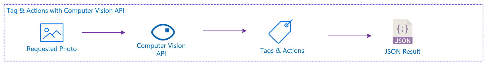

# Microsoft Cognitive Services - Computer Vision ile Fotoğraf Analizi ve OCR

Microsoft'un AI alanında tüm geliştiricilere sunmuş olduğu çok fazla ürün seçenekleri bulunuyor. Bu ürünler arasında hem veri bilimcilerin kullanabileceği hem de yazılım geliştirebileceği yapay zeka tabanlı servisler bulunuyor.

Bu örnek de görüntü işleme konusunda yazılım geliştiricilerin kullanabileceği, özel olarak tanımlatmak isteyeceğiniz nesneleri tanımlayabileceğiniz 
[Microsoft Cognitive Service](http://www.microsoft.com/cognitive) 'in altında yer alan servislerden birisi olan [Computer Vision API](https://azure.microsoft.com/en-us/services/cognitive-services/computer-vision/) servisini inceleyeceğiz. 

## Computer Vision API'in çalışma mantığı
Computer Vision API görüntü işleme, OCR (Optical Character Recognition), el yazısı tanımlama gibi çeşitli başlıklar altında  

Custom Vision API'ın çalışma mantığı tanınmasını istediğiniz fotoğraflarla sistemi eğiterek, bir tahmin modelinin oluşturulmasını sağlıyor. Daha sonra bu modeli kullanarak test etmek istediğiniz fotoğrafların bu modellere ne kadar yakın olduğunu size dönebiliyor.

Buradaki temel mantık fotoğraflarda benzerlikler üzerinden eğitildiği için tam olarak neyi öğrenmesi gerektiğini sizin verdiğiniz fotoğrafların içeriği ve eklediğiniz ``Tag`` ler belirliyor.

### Tag & Actions
 

### OCR
 

### Subcription Key Alma 
Microsoft Cognitive Services - Computer Vision key'ine erişebilmek için Microsoft Azure hesabınız olması gerekiyor, hesap edinmek için aşağıdaki adımları takip edebilirsiniz.
1. Microsoft Azure hesabı oluşturmak için [http://azure.com](http://azure.com) adresine giderek yeni bir hesap oluşturun.
1. Hesabı oluşturduktan sonra [http://portal.azure.com](http://portal.azure.com) adresine erişin.
1. ürünler menüsünden **New** seçeneğini seçin.
1. **AI + Cognitive Services** kategorisini seçin.
1. Sağ üst köşeden **See All** 'a tıklayın.
1. **Computer Vision** seçeneğini seçin.
1. **Create** butonuna tıklayın.
1. Karşınıza çıkan alanları doldurun.
1. **Pricing Tier** bölümünde size uygun olan seçeneği seçin.
1. **Create** butonuna tıklayın.
1. Şu anda Computer Vision proejeniz aktif olarak oluştu.
1. **All Resources** içerisinden oluşturduğunuz Computer Vision'ı seçin.
1. **Keys** bölümünden Key içeriğini alın.

