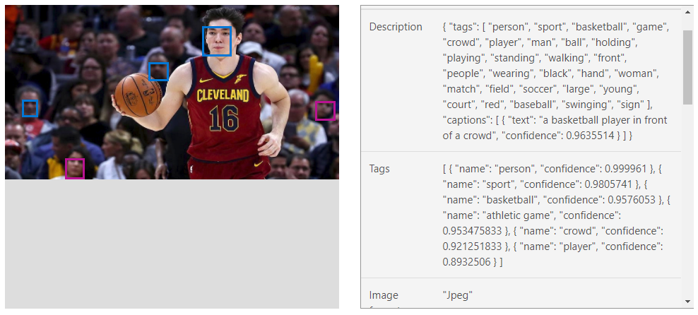
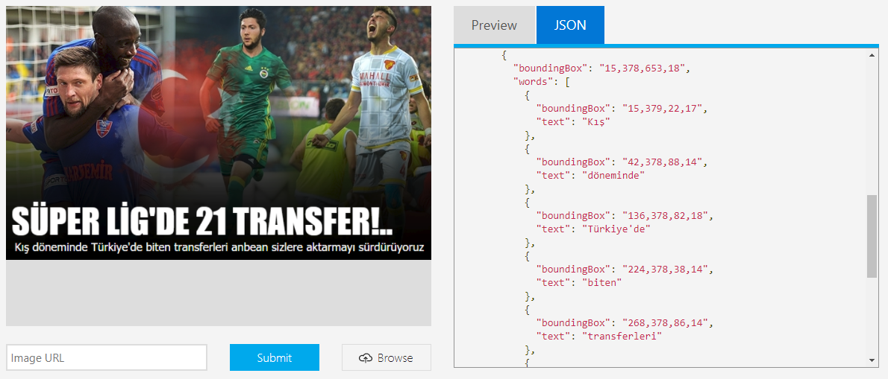
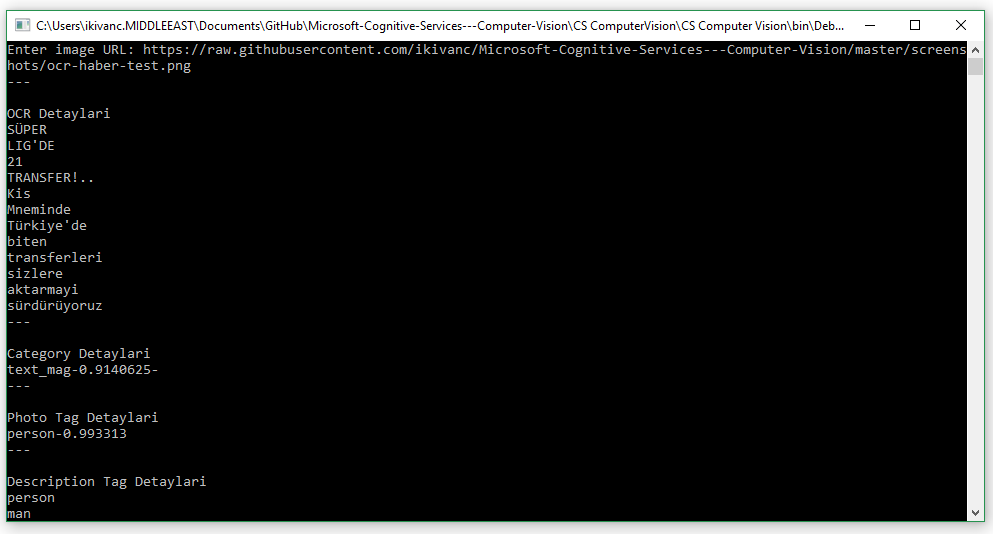
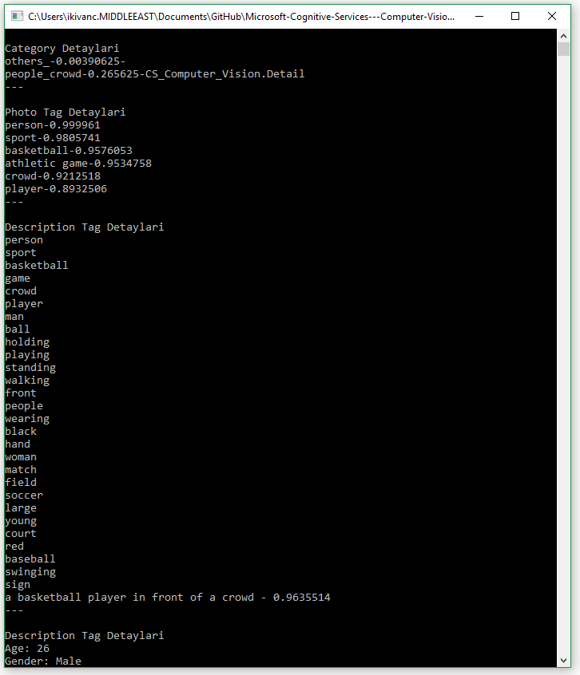

# Microsoft Cognitive Services - Computer Vision ile Fotoğraf Analizi ve OCR

Microsoft'un AI alanında tüm geliştiricilere sunmuş olduğu çok fazla ürün seçenekleri bulunuyor. Bu ürünler arasında hem veri bilimcilerin kullanabileceği hem de yazılım geliştirebileceği yapay zeka tabanlı servisler bulunuyor.

Bu örnek de görüntü işleme konusunda yazılım geliştiricilerin kullanabileceği, özel olarak tanımlatmak isteyeceğiniz nesneleri tanımlayabileceğiniz 
[Microsoft Cognitive Service](http://www.microsoft.com/cognitive) 'in altında yer alan servislerden birisi olan [Computer Vision API](https://azure.microsoft.com/en-us/services/cognitive-services/computer-vision/) servisini inceleyeceğiz.

## Computer Vision API'in çalışma mantığı
Computer Vision API görüntü işleme, OCR (Optical Character Recognition), el yazısı tanımlama gibi çeşitli başlıklar altında çözümler sunmakta. Bu örnekte Görüntü tanımlama, OCR örneğini inceleyeceğiz fakat fotoğrafta ünlü bir kişi varsa onu tespit etmek için ve de bir fotoğrafta farklı boyutlarda en optimum tumbnail için fotoğraf kesiminin gerçekleşmesini sağlamaktadır.

Computer Vision API'ın tüm çıktıları read-only olduğu için sistemi maalesef eğitemiyoruz.
Görüntülerle eğitebilmek için [Custom Vision Service örneği]( https://github.com/ikivanc/Custom-Vision-Prediction-Ornegi) 'nde olduğu gibi kendiniz eğitebilir veya [CNTK](https://www.microsoft.com/en-us/cognitive-toolkit/) ve [Azure Machine Learning](https://studio.azureml.net/) sayesinde de görüntü işleme ile kendi eğittiniz modelleri oluşturabilirsiniz.

Computer vision servisini daha detaylı incelemek ve de web arayüzünden kendi testlerinizi oluşturmak için [Microsoft Cognitive Services - Computer Vision](https://azure.microsoft.com/en-us/services/cognitive-services/computer-vision/) sayfasını ziyaret edebilirsiniz.

### Tag & Actions

Bu örnekteki temel mantık fotoğraflarda bulunan nesnelere ve aksiyonlara göre sizlere tag ve aksiyon çıktıları dönmekte. Bu çıktıları da isteğinize göre düzenleyebilirsiniz.

Örnek olarak Cedi Osman'ın bir fotoğrafını verdiğimizde bize aşağıdaki detayları ve daha fazlasını dönebilmekte.

 
 


### OCR

Aşağıdaki örnekte bir haber sitesinin manşetini **Türkçe** olarak tanıyabilmekte olduğunu görebilir ve diğer tüm dökümanları da aynı şekilde tarayabileceğini görebilirsiniz. 

 
 


Biz de bu örnekleri linklerini programımıza vererek dönen sonuçları görebiliriz.

## Yeni bir Computer Vision Services projesi oluşturulması

Fotoğrafları analiz etmek için Azure üzerinden Microsoft Cognitive Services'ş kullanmak yeterli. Bunun için aşağıdaki adımları kullanabilirsiniz.

### Subcription Key Alma 
Microsoft Cognitive Services - Computer Vision key'ine erişebilmek için Microsoft Azure hesabınız olması gerekiyor, hesap edinmek için aşağıdaki adımları takip edebilirsiniz.
1. Microsoft Azure hesabı oluşturmak için [http://azure.com](http://azure.com) adresine giderek yeni bir hesap oluşturun.
1. Hesabı oluşturduktan sonra [http://portal.azure.com](http://portal.azure.com) adresine erişin.
1. ürünler menüsünden **New** seçeneğini seçin.
1. **AI + Cognitive Services** kategorisini seçin.
1. Sağ üst köşeden **See All** 'a tıklayın.
1. **Computer Vision** seçeneğini seçin.
1. **Create** butonuna tıklayın.
1. Karşınıza çıkan alanları doldurun.
1. **Pricing Tier** bölümünde size uygun olan seçeneği seçin.
1. **Create** butonuna tıklayın.
1. Şu anda Computer Vision proejeniz aktif olarak oluştu.
1. **All Resources** içerisinden oluşturduğunuz Computer Vision'ı seçin.
1. **Keys** bölümünden Key içeriğini alın.

## Computer Vision API ile C# kodunun entegre edilmesi
Aşağıdaki kod örneğinde de girdiğiniz bir fotoğraf URL'i aracılığı ile fotoğrafınızın içeriğini tespit edebilirsiniz. isterseniz de fotoğrafı yükleyerek de test edebilirsiniz.

### Computer Vision ile Fotoğraf Analizi

```csharp
...
       
        static async void ComputerVisionRequest(string imageUrl)
        {
            var client = new HttpClient();

            // Face, Tags, Categories, ImageType, Color, Celebrity, Landmark detaylarının alınacağı sorgu aşağıdaki gibidir
            client.DefaultRequestHeaders.Add("Ocp-Apim-Subscription-Key", subscriptionKey_Vision);
            string uri = uriBase_Vision + "/analyze?visualFeatures=Faces,Tags,categories,Description,ImageType,Color&details=Celebrities,Landmarks";


            HttpResponseMessage response;

            // Request body
            byte[] byteData = Encoding.UTF8.GetBytes("{\"Url\": \"" + imageUrl + "\"}");
            using (var content = new ByteArrayContent(byteData))
            {
                content.Headers.ContentType = new MediaTypeHeaderValue("application/json");
                response = await client.PostAsync(uri, content);

                //Json Deserialization
                string json = response.Content.ReadAsStringAsync().Result;
                json = json.TrimStart(new char[] { '[' }).TrimEnd(new char[] { ']' });
                ComputerVision photoVision = JsonConvert.DeserializeObject<ComputerVision>(json);

                List<string> myTags = new List<string>();
                Console.WriteLine("---\n\nCategory Detayları");
                foreach (Category pCategory in photoVision.Categories)
                {
                    Console.WriteLine(pCategory.Name + "-" + pCategory.Score + "-" + pCategory.Detail);
                }

                Console.WriteLine("---\n\nPhoto Tag Detayları");
                foreach (Tag pTag in photoVision.Tags)
                {
                    Console.WriteLine(pTag.Name + "-" + pTag.Confidence);
                    myTags.Add(pTag.Name);
                }

                Console.WriteLine("---\n\nDescription Tag Detayları");
                foreach (string pTag in photoVision.Description.Tags)
                {
                    Console.WriteLine(pTag);
                    myTags.Add(pTag);
                }

                List<string> myDecription = new List<string>();
                foreach (Caption pCaption in photoVision.Description.Captions)
                {
                    Console.WriteLine(pCaption.Text + " - " + pCaption.Confidence);
                    myDecription.Add(pCaption.Text);
                }


                foreach (Face pface in photoVision.Faces)
                {
                    Console.WriteLine("---\n\nDescription Tag Detayları");
                    Console.WriteLine("Age: " + pface.Age);
                    Console.WriteLine("Gender: " + pface.Gender);
                }

                Console.WriteLine("---\n\nColor Tag Detayları");
                Console.WriteLine("dominantColorForeground: " + photoVision.Color.DominantColorForeground);
                Console.WriteLine("dominantColorBackground: " + photoVision.Color.DominantColorBackground);
                Console.WriteLine("accentColor: " + photoVision.Color.AccentColor);
                Console.WriteLine("isBWImg: " + photoVision.Color.IsBWImg);

                Console.WriteLine("---\n\nDominantColors Detayları");
                foreach (string dColors in photoVision.Color.DominantColors)
                {
                    Console.WriteLine(dColors);
                }

            }
        }
...
```

### Computer Vision API ile OCR
```csharp
...

   static async void OCRRequest(string imageUrl)
        {

            var client = new HttpClient();

            // Request headers
            client.DefaultRequestHeaders.Add("Ocp-Apim-Subscription-Key", subscriptionKey_Vision);
            string uri = uriBase_Vision + "/ocr?language=tr&detectOrientation=true";
            HttpResponseMessage response;

            // Request body
            byte[] byteData = Encoding.UTF8.GetBytes("{\"Url\": \"" + imageUrl + "\"}");

            using (var content = new ByteArrayContent(byteData))
            {
                try
                {
                    content.Headers.ContentType = new MediaTypeHeaderValue("application/json");
                    response = await client.PostAsync(uri, content);

                    //JSON Deserialization
                    string json = response.Content.ReadAsStringAsync().Result;
                    json = json.TrimStart(new char[] { '[' }).TrimEnd(new char[] { ']' });
                    OCRVision ocrVision = JsonConvert.DeserializeObject<OCRVision>(json);

                    Console.WriteLine("---\n\nOCR Detayları");
                    //OCR'dan elde edilen sonuçların ekrana yazılması
                    foreach (Region ereg in ocrVision.Regions)
                    {
                        foreach (Line sline in ereg.Lines)
                        {
                            foreach (Word sword in sline.Words)
                            {
                                Console.Write(sword.Text + "\n");
                            }
                        }
                    }
                }
                catch
                {
                    Console.Write("OCR couldn't find");
                }
            }
        }
...
```

## Kodun çıktısı

Girdiğiniz bir örnek fotoğraf linki aracılığı ile sonucu görmek isterseniz de çıktınız aşağıdaki gibi olacaktır.


### Optical Character Recognition (OCR)
OCR için de aşağıdaki haber başlığının görüntü linkini veya kendi test etmek istediğiniz metin görüntüsünün linkini kullanabilirsiniz.
[https://raw.githubusercontent.com/ikivanc/Microsoft-Cognitive-Services---Computer-Vision/master/screenshots/ocr-haber-test.png](https://raw.githubusercontent.com/ikivanc/Microsoft-Cognitive-Services---Computer-Vision/master/screenshots/ocr-haber-test.png)



### Fotoğraf Analizi 
Fotoğraf analizi için aşağıdaki Cedi Osmanın fotoğraf linkini veya kendi test etmek istediğiniz fotoğraf linkini kullanabilirsiniz.
[https://raw.githubusercontent.com/ikivanc/Microsoft-Cognitive-Services---Computer-Vision/master/screenshots/ocr-haber-test.png](https://raw.githubusercontent.com/ikivanc/Microsoft-Cognitive-Services---Computer-Vision/master/screenshots/ocr-haber-test.png)



Bu örneklerde de gördüğümüz gibi, Microsoft'un sunmuş olduğu API Set'i ile yapay zeka ile görüntü işleme ve OCR ile yazı tespit etmeyi çok rahat bir şekilde kendi uygulamalarınıza entegre edebilirsiniz.

Sizler de kurumlarınız için gerekli olan çeşitli entegrasyonları da farklı senaryolarda kullanabilirsiniz.

* Fotoğraflardan hashtag/tag'lerin çıkartılması
* Döküman arşivlerinin yazıya aktarılması
* Fotoğraf arşivinden metadata ve aksiyonların çıkartılması
* Fotoğraftaki kişilerin yaşları, cinsiyetleri ve mutluluklarının belirlenmesi
* Yüksek çözünürlüklü fotoğraflar için otomatik thumbnail'lerin oluşturulması

Gibi pek çok senaryoyu bu servisler ile çıkartabilirsiniz.

iyi çalışmalar.